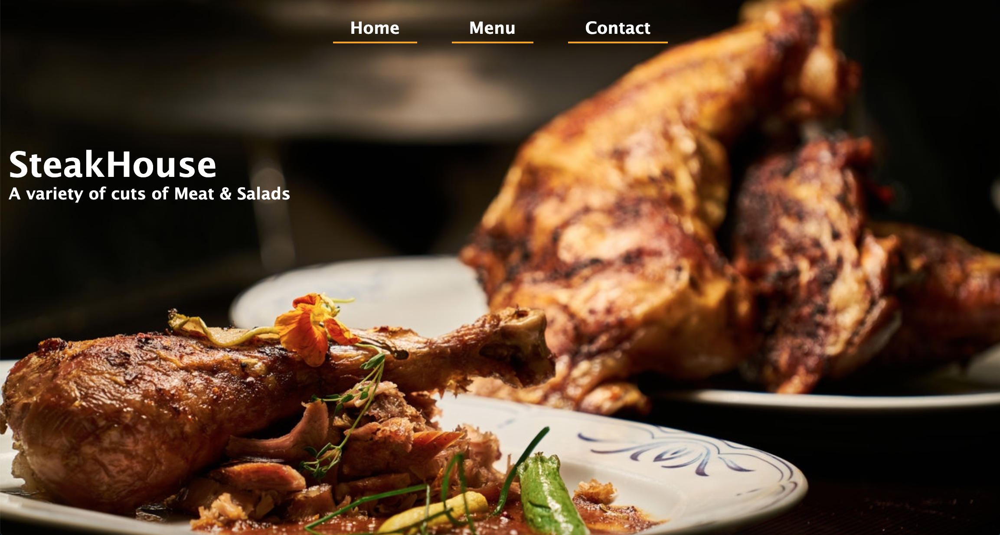

# Restaurant Page
A simple restaurant site built using Javascript alone to generate its entire content.

## Built With

- JavaScript
- Webpack
- HTML/CSS

[Live Demo Link](https://raw.githack.com/Mupa1/Restaurant-Page/restaurant_page/dist/index.html)

## Getting Started
To get a copy up and running follow these simple example steps:-
- Clone `https://github.com/Mupa1/Restaurant-Page.git` to your local machine.
- cd into the Restaurant-Page directory and navigate into the dist directory.
- Run index.html in a browser.

To make changes
- Run `npm install` to install dependancies.
- Open Restaurant-Page directory in you favorite editor.
- Navigate to src folder to make any changes.
- To preview changes live, use npm run dev from your terminal then run index.hmtl in the browser.
- When you finish your changes, run npm run build to create the production files to the dist folder.

## Automated Test
 > No automated tests yet for this project.

## Author

👤 **Mupa M'mbetsa Nzaphila**

- Github: [@mupa1](https://github.com/Mupa1)
- Twitter: [@mupa_mmbetsa](https://twitter.com/mupa_mmbetsa)
- Linkedin: [mupa-mmbetsa](https://www.linkedin.com/in/mupa-mmbetsa)

## 🤝 Contributing

Contributions, issues and feature requests are welcome!

Feel free to check the [issues page](https://github.com/Mupa1/Restaurant-Page/issues).

## Show your support

Give a ⭐️ if you like this project!

